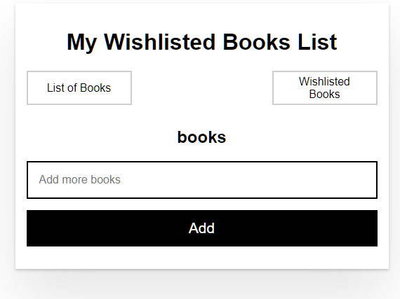

# Created with Angular CLI from https://angular.io

## Start project 

In the project directory, with angular-cli installed you can run:

### `npm i`

Install the dependencies for project

### `bg serve`

Runs the app in the development mode.\
Open [localhost:4200](localhost:4200) to view it in your browser.

You'll see a form with an inputbox and two buttons, you can add books with the inputbox and see both lists(All books, Wishlisted books).
To add a book to the wishlist you'll need to click on the checkbox
